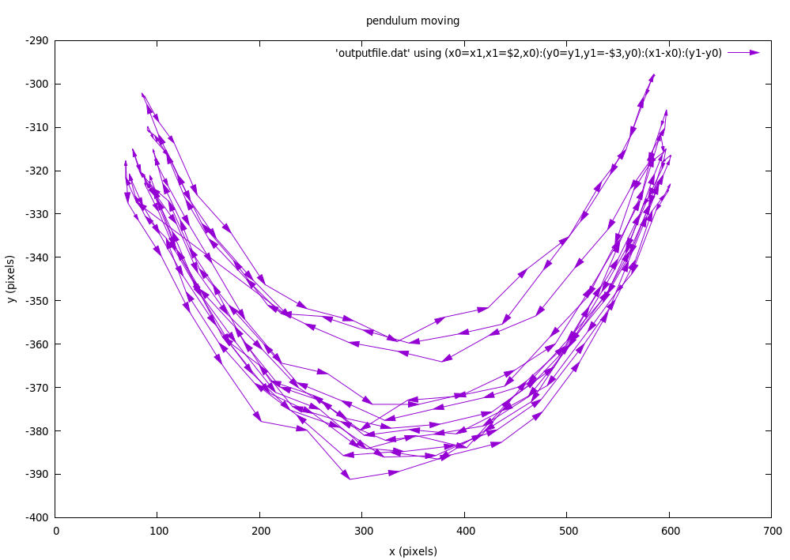
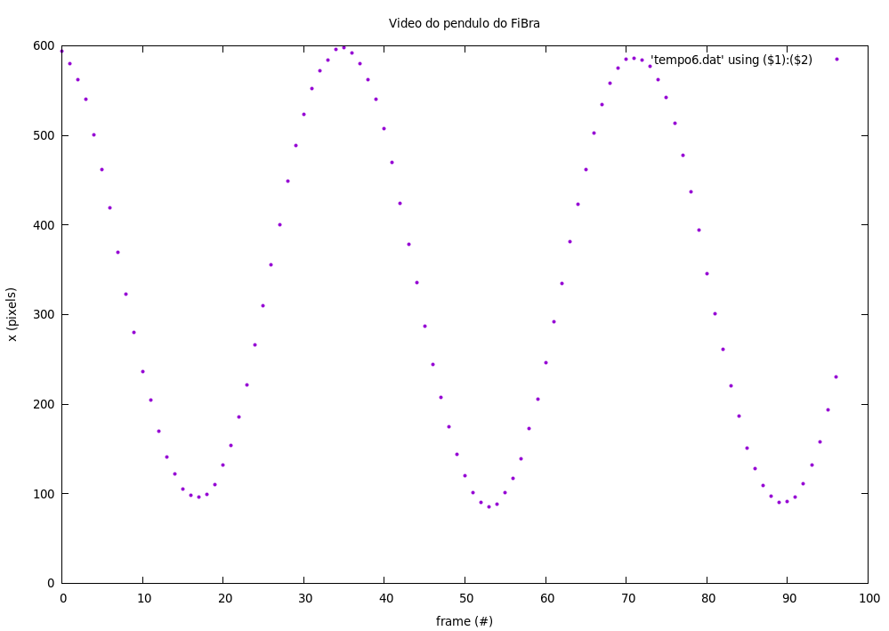
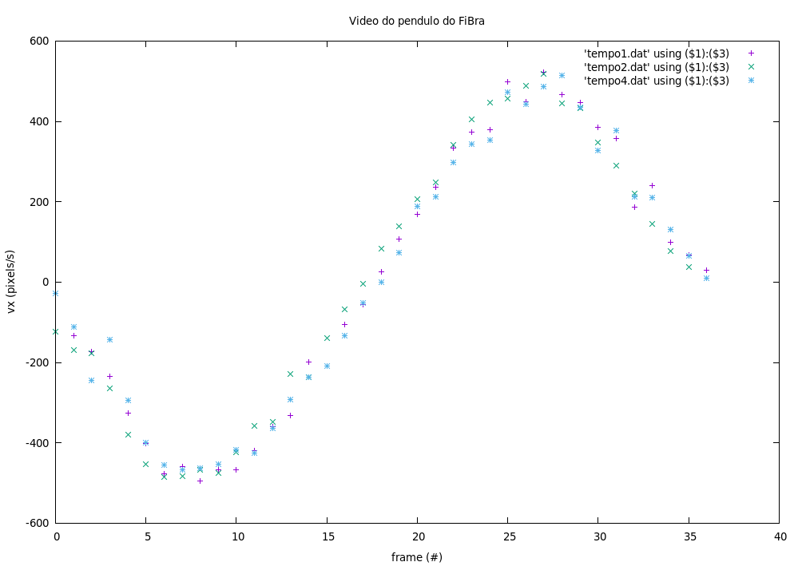

# pendulum-opencv
Script to detect and track a real simple pendulum's motion in order to draw its main physical vectors (velocity, acceleration and so on).
I'm writing a final work in Physics Teaching and the goal is to create an Augmented Reality that allows students and visitors to "see" physics vectors simultaneously with an experiment conducted in a science museum. OpenCV has good features for that and later I can wrap it in an Android SDK.
What I got so far:

0. Installation in Linux (far straightforward);
1. Capture and loop frames from the file called "20190829_150101.mp4" (aftwerwards channel it to the default camera);
2. Isolate what's moving: Background Subtraction method has an update better than Absdiff (which deletes the stationary ball at its maximal amplitude);
3. Establish Region of Interest ROI: Object Detection can avoid taking visitors' or any other motion into account (not initialized yet);
3.1 Based on format (Circle) - Hough transform? minEnclosingCircle?;
3.2 Based on color (Green) H: [70, 160], S: [0,100], V: [0,100];
4. Track motion: meanShift is based on pixel's density displacement and it's strictly dependent on the ROI;
5. Find the physical center of mass: function "Moments" calculates the centroid, which need to be correctly positioned from ROI to the actual frame;
6. Record time elapsed: using "getTickCount()" worked better than "time_t" function - remember: the shorter the time interval, the better.
7. Calculate and show displacement: in order to have a substantial displacement - pixel quite apart from each other - store three positions in a vector and ignore the middle one (maybe there's a better solution using a fork method - I cannot say);
8. Calculate and show velocity:  (i) calculate backwards, forward or midpoint (chosen) velocity based on the future and on the past; (ii) in order to show it, use only a x or y component: arrowedLine (c_x, c_y) → (c_x + v_x, c_y)  or arrowedLine(c_x, c_y) → (c_x, c_y + v_y);
9. Calculate and show acceleration: use finite elements principle (a_x[i] = c_x[i+2] - 2.c_x[i+1] + c_x[i]) in x and y axis (a_x and a_y). Acceleration has tangencial and radial (a_t and a_r) components as well. The tangencial vector is nothing but velocity's unitary vector (ŧ = v/|v|), while the radial one is perpendicular and swaps the latter's components with some conditions (i.e., always points upwards). Therefore, acceleration is obtainable through dor product: a = [(a • ŧ)ŧ  , (a • ř)ř]; 

| Trajectory through frames is roughly the same | Position in x axis is periodical |
|------------|-------------| 
| | |

| Vx is also periodical and the same | Acceleration |
|------------|-------------| 
| | |

Watch the video:

